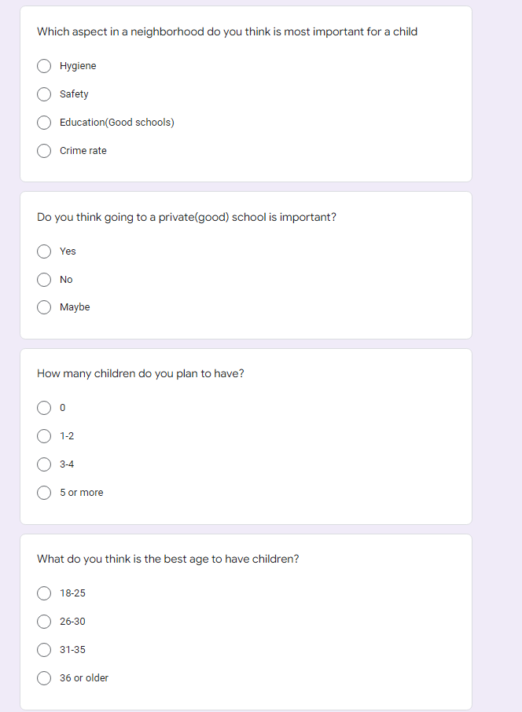

Website for github^[https://github.com/Qianyuan-Huang/STA304_paper3]

```{r, echo=FALSE, include=FALSE, message=FALSE}
library(readxl)
library(tidyverse)
library(janitor)
library(tinytex)
```
```{r, echo=FALSE, include=FALSE, message=FALSE}
#cite the packages
citation("tidyverse")
citation("readxl")
citation("janitor")
print(citation("tinytex"), bibtex=TRUE)
citation("dplyr")
citation("ggplot2")
citation()
```


#1 Introduction
Whether we are assessing options for changing the society, attempting to make changes to improve the well-being of children. Policy makers need to make proper assessments on trends in families and children. These data were based on General Social Survey.  Our aim is to help the policy makers take out all the useful data and make models to explain certain trends on families and children to ensure they can have accurate information when making policies. Children will be the future of our society and they are very important. We would want this project to help make more comprehensive and improve policies in the current society. Therefore, family and children would both be important in responding to the survey.\
A short survey was created and conducted by the government to access the opinions of Ontario people. This survey includes over thousands of respondents from all over the Ontario region. The survey was conducted online in which we would send email and letters to citizens that are willing to participate in the survey. We included the purpose and the link to allow respondents to access the survey. To ensure that each response is unique and to make sure respondents don’t do the survey repeatedly. The survey maybe accessed only by each unique email address once.  From our responses we have response that shows there are several factors that have an effective change on the number of children in Canada which includes religion, marital status (divorced, married), in which we can see religion has had one the most significant effects on the number of children in a family. Lots of family think that religion has played a huge part in deciding how many children they want and have. This would mean that in order to write policies it would important for policymakers to consider all these different factors.\ 
From the survey we have obtained, it was observed that citizens responding towards questions regarding marriage may include response bias. This maybe due to some might not feel comfortable answering certain sensitive quest.\

```{r, echo=FALSE, message=FALSE, include=FALSE}
raw_data <- read_csv("AAumt3Zj.csv")
dict <- read_lines("gss_dict.txt", skip = 18) 
labels_raw <- read_file("gss_labels.txt")
#### Set-up the dictionary ####
# What we want is a variable name and a variable definition
variable_descriptions <- as_tibble(dict) %>% 
  filter(value!="}") %>% 
  mutate(value = str_replace(value, ".+%[0-9].*f[ ]{2,}", "")) %>% 
  mutate(value = str_remove_all(value, "\"")) %>% 
  rename(variable_description = value) %>% 
  bind_cols(tibble(variable_name = colnames(raw_data)[-1]))
 
# Now we want a variable name and the possible values
labels_raw_tibble <- as_tibble(str_split(labels_raw, ";")[[1]]) %>% 
  filter(row_number()!=1) %>% 
  mutate(value = str_remove(value, "\nlabel define ")) %>% 
  mutate(value = str_replace(value, "[ ]{2,}", "XXX")) %>% 
  mutate(splits = str_split(value, "XXX")) %>% 
  rowwise() %>% 
  mutate(variable_name = splits[1], cases = splits[2]) %>% 
  mutate(cases = str_replace_all(cases, "\n [ ]{2,}", "")) %>%
  select(variable_name, cases) %>% 
  drop_na()

# Now we have the variable name and the different options e.g. age and 0-9, 10-19, etc.
labels_raw_tibble <- labels_raw_tibble %>% 
  mutate(splits = str_split(cases, "[ ]{0,}\"[ ]{0,}"))


add_cw_text <- function(x, y){
  if(!is.na(as.numeric(x))){
    x_new <- paste0(y, "==", x,"~")
  }
  else{
    x_new <- paste0("\"",x,"\",")
  }
  return(x_new)
}

# The function will be in the row, but it'll get the job done
cw_statements <- labels_raw_tibble %>% 
  rowwise() %>% 
  mutate(splits_with_cw_text = list(modify(splits, add_cw_text, y = variable_name))) %>% 
  mutate(cw_statement = paste(splits_with_cw_text, collapse = "")) %>% 
  mutate(cw_statement = paste0("case_when(", cw_statement,"TRUE~\"NA\")")) %>% 
  mutate(cw_statement = str_replace(cw_statement, ",\"\",",",")) %>% 
  select(variable_name, cw_statement)
# So for every variable we now have a case_when() statement that will convert 
# from the number to the actual response.

# Just do some finally cleanup of the regex.
cw_statements <- 
  cw_statements %>% 
  mutate(variable_name = str_remove_all(variable_name, "\\r")) %>% 
  mutate(cw_statement = str_remove_all(cw_statement, "\\r"))


#### Apply that dictionary to the raw data ####
# Pull out a bunch of variables and then apply the case when statement for the categorical variables
gss <- raw_data %>% 
  select(CASEID, 
         agedc, 
         achd_1c, 
         achdmpl, 
         totchdc, 
         acu0c,
         agema1c,
         achb1c,
         rsh_131a,
         arretwk,
         slm_01, 
         sex, 
         brthcan, 
         brthfcan,
         brthmcan,
         brthmacr,
         brthprvc,
         yrarri,
         prv, 
         region, 
         luc_rst, 
         marstat, 
         amb_01, 
         vismin, 
         alndimmg,
         bpr_16, 
         bpr_19,
         ehg3_01b, 
         odr_10, 
         livarr12, 
         dwelc, 
         hsdsizec,
         brthpcan,
         brtpprvc, 
         visminpr,
         rsh_125a, 
         eop_200,
         uhw_16gr,
         lmam_01, 
         acmpryr,
         srh_110,
         srh_115,
         religflg, 
         rlr_110,
         lanhome, 
         lan_01,
         famincg2, 
         ttlincg2, 
         noc1610, 
         cc_20_1,
         cc_30_1,
         ccmoc1c,
         cor_031,
         cor_041,
         cu0rnkc,
         pr_cl,
         chh0014c,
         nochricc,
         grndpa,
         gparliv,
         evermar,
         ma0_220,
         nmarevrc,
         ree_02,
         rsh_131b,
         rto_101,
         rto_110,
         rto_120,
         rtw_300,
         sts_410,
         csp_105,
         csp_110a,
         csp_110b,
         csp_110c,
         csp_110d,
         csp_160,
         fi_110) %>% 
  mutate_at(vars(agedc:fi_110), .funs = funs(ifelse(.>=96, NA, .))) %>% 
  mutate_at(.vars = vars(sex:fi_110),
            .funs = funs(eval(parse(text = cw_statements %>%
                                      filter(variable_name==deparse(substitute(.))) %>%
                                      select(cw_statement) %>%
                                      pull()))))

# Fix the names
gss <- gss %>% 
  clean_names() %>% 
  rename(age = agedc,
         age_first_child = achd_1c,
         age_youngest_child_under_6 = achdmpl,
         total_children = totchdc,
         age_start_relationship = acu0c,
         age_at_first_marriage = agema1c,
         age_at_first_birth = achb1c,
         distance_between_houses = rsh_131a,
         age_youngest_child_returned_work = arretwk,
         feelings_life = slm_01,
         sex = sex,
         place_birth_canada = brthcan,
         place_birth_father = brthfcan,
         place_birth_mother = brthmcan,
         place_birth_macro_region = brthmacr,
         place_birth_province = brthprvc,
         year_arrived_canada = yrarri,
         province = prv,
         region = region,
         pop_center = luc_rst,
         marital_status = marstat,
         aboriginal = amb_01,
         vis_minority = vismin,
         age_immigration = alndimmg,
         landed_immigrant = bpr_16,
         citizenship_status = bpr_19,
         education = ehg3_01b,
         own_rent = odr_10,
         living_arrangement = livarr12,
         hh_type = dwelc,
         hh_size = hsdsizec,
         partner_birth_country = brthpcan,
         partner_birth_province = brtpprvc,
         partner_vis_minority = visminpr,
         partner_sex = rsh_125a,
         partner_education = eop_200,
         average_hours_worked = uhw_16gr,
         worked_last_week = lmam_01,
         partner_main_activity = acmpryr,
         self_rated_health = srh_110,
         self_rated_mental_health = srh_115,
         religion_has_affiliation = religflg,
         regilion_importance = rlr_110,
         language_home = lanhome,
         language_knowledge = lan_01,
         income_family = famincg2,
         income_respondent = ttlincg2,
         occupation = noc1610,
         childcare_regular = cc_20_1,
         childcare_type = cc_30_1,
         childcare_monthly_cost = ccmoc1c,
         ever_fathered_child = cor_031,
         ever_given_birth = cor_041,
         number_of_current_union = cu0rnkc,
         lives_with_partner = pr_cl,
         children_in_household = chh0014c,
         number_total_children_intention = nochricc,
         has_grandchildren = grndpa,
         grandparents_still_living = gparliv,
         ever_married = evermar,
         current_marriage_is_first = ma0_220,
         number_marriages = nmarevrc,
         religion_participation = ree_02,
         partner_location_residence = rsh_131b,
         full_part_time_work = rto_101,
         time_off_work_birth = rto_110,
         reason_no_time_off_birth = rto_120,
         returned_same_job = rtw_300,
         satisfied_time_children = sts_410,
         provide_or_receive_fin_supp = csp_105,
         fin_supp_child_supp = csp_110a,
         fin_supp_child_exp = csp_110b,
         fin_supp_lump = csp_110c,
         fin_supp_other = csp_110d,
         fin_supp_agreement = csp_160,
         future_children_intention = fi_110) 

#### Clean up ####
gss <- gss %>% 
  mutate_at(vars(age:future_children_intention), 
            .funs = funs(ifelse(.=="Valid skip"|.=="Refusal"|.=="Not stated", "NA", .))) 

gss <- gss %>% 
  mutate(is_male = ifelse(sex=="Male", 1, 0)) 

gss <- gss %>% 
  mutate_at(vars(fin_supp_child_supp:fin_supp_other), .funs = funs(case_when(
    .=="Yes"~1,
    .=="No"~0,
    .=="NA"~as.numeric(NA)
  )))

main_act <- raw_data %>% 
  mutate(main_activity = case_when(
    mpl_105a=="Yes"~ "Working at a paid job/business",
    mpl_105b=="No" ~ "Looking for paid work",
    mpl_105c=="No" ~ "Going to school",
    mpl_105d=="No" ~ "Caring for children",
    mpl_105e=="No" ~ "Household work", 
    mpl_105i=="Yes" ~ "Other", 
    TRUE~ "NA")) %>% 
  select(main_activity) %>% 
  pull()

age_diff <- raw_data %>% 
  select(marstat, aprcu0c, adfgrma0) %>% 
  mutate_at(.vars = vars(aprcu0c:adfgrma0),
            .funs = funs(eval(parse(text = cw_statements %>%
                                      filter(variable_name==deparse(substitute(.))) %>%
                                      select(cw_statement) %>%
                                      pull())))) %>% 
  mutate(age_diff = ifelse(marstat=="Living common-law", aprcu0c, adfgrma0)) %>% 
  mutate_at(vars(age_diff), .funs = funs(ifelse(.=="Valid skip"|.=="Refusal"|.=="Not stated", "NA", .))) %>% 
  select(age_diff) %>% 
  pull()

gss <- gss %>% mutate(main_activity = main_act, age_diff = age_diff)

# Change some from strings into numbers
gss <- gss %>% 
  rowwise() %>% 
  mutate(hh_size = str_remove(string = hh_size, pattern = "\\ .*")) %>% 
  mutate(hh_size = case_when(
    hh_size=="One" ~ 1,
    hh_size=="Two" ~ 2,
    hh_size=="Three" ~ 3,
    hh_size=="Four" ~ 4,
    hh_size=="Five" ~ 5,
    hh_size=="Six" ~ 6
  )) 


gss <- gss %>% 
  rowwise() %>% 
  mutate(number_marriages = str_remove(string = number_marriages, pattern = "\\ .*")) %>% 
  mutate(number_marriages = case_when(
    number_marriages=="No" ~ 0,
    number_marriages=="One" ~ 1,
    number_marriages=="Two" ~ 2,
    number_marriages=="Three" ~ 3,
    number_marriages=="Four" ~ 4
  )) 

gss <- gss %>% 
  rowwise() %>% 
  mutate(number_total_children_known = ifelse(number_total_children_intention=="Don't know"|number_total_children_intention=="NA", 0, 1)) %>% 
  mutate(number_total_children_intention = str_remove(string = number_total_children_intention, pattern = "\\ .*")) %>% 
  mutate(number_total_children_intention = case_when(
    number_total_children_intention=="None" ~ 0,
    number_total_children_intention=="One" ~ 1,
    number_total_children_intention=="Two" ~ 2,
    number_total_children_intention=="Three" ~ 3,
    number_total_children_intention=="Four" ~ 4,
    number_total_children_intention=="Don't" ~ as.numeric(NA)
  )) 

write_csv(gss, "gss.csv")
```

```{r,echo=FALSE, message=FALSE, include=FALSE, warning=FALSE}
gss <- read_csv("gss.csv")
```

#2 Data 
The data is analysis and cleaned in R [@R1] using readxl [@P2], jenitor [@P3], the tidyverse [@P1], and dplyr packages [@P5] in the Rstudio.\
Firstly, the data cleaning is conductd to get the tidy data. The EDA is done using statistical knowledge and the corresponding graphs are generated by ggplot2 [@P6]. Finally, after all the analysis and conclusion, the paper is knitted in Rmarkdown.\


## 2.1 Data Source 
The report used data source of 20603 observations from 2013 Canadian General Social Survey(GSS), the dataset was obtained from the University of Toronto Computing in the Humanities and Social Sciences (CHASS) Database Centre and can be accessed by everyone with access to UofT library system. GSS General Social Survey was established in 1985 and the overall objectives of the program were gathering data on social trends in order to monitor changes in the living conditions and well-being of Canadians, and to provide information on specific social policy issues. The survey in 2013 was conducted with the Computer Assisted Telephone Interviewing (CATI).\


## 2.2 Bias
There are various sources of bias in this survey. One of which is the dataset is from 2013. With events happening throughout the years including COVID-19. The data may not be very accurate. People after covid-19 may have a very large change in their perspective of value which will lead to different factors affecting the number of children [@A1]. Not only the change of perspective but some may not be living together as a household anymore meaning there may be a change of the size of the household or the people living in the household. this can cause inaccurate information from respondents.\
Since the survey conducted is completely anonymous, the ethicality of the survey is handled properly. However, it would also be hard for us to do make sure that the surveys are done correctly and who responded to certain questions as respondents have the option to skip the question. This may lead to lack of responds of certain group of people to specific questions. 
One of the bias may be the different people responding to the surveys. every year, we may have different portion of the sample responding to the survey, this may cause an imbalance sampling for the other years as the people responding to the survey is different. To ensure this doesn’t affect the results of our analysis, we would try to keep track of the people responding and account for the trends in the respondents.\ 
 


## 2.3 Data Overview and Cleaning 
The raw data we used contain 461 variables with 20602 observation and we selected 81 variables and 12736 observations that are most representative into the project. Since what we want is a variable name and a variable definition, we first set up a dictionary to rename the variable to be more visualized. Then we delete all the observation with no response to the crucial variable such as total number of children in house, age, or age at the birth. Than we change some variable from strings into numbers. We mutate the question with answer “Yes” or “No’’ in to “1” or “0” and mutate the variable with “valid skip”, “no response”, “refusal”, or “not stated” into “NA”.\

As for other variable with complicated answers such as main activity, we group them according to the activity category. We set all the job with proper salary as “Yes” and the activity such as “Looking for paid work” or “Household work” as “No”.\


## 2.4 Data Summary 
```{r, echo=FALSE, message=FALSE}
#data cleaning by deleting the missing value for age,age_at_first_birth and total_children
#the complete data is obtained
gss_clean <- gss%>%
   filter(!is.na(age)) %>%
  filter(!is.na(age_at_first_birth)) %>%
  filter(!is.na(total_children)) 
  
```
```{r, echo=FALSE, message=FALSE}
agetable <- gss_clean %>% summarise(
  min = min(age), Q1 = quantile(age, 0.25) ,median = median(age), Q3 = quantile(age, 0.75), max = max(age), mean = mean(age), var = var(age)
)

knitr::kable(agetable , caption = "Table 1: Age Summary Table")
```
The summary of the age showd the minimum age of the respondent is 20.3 and the maximun age is 80, which shows the dataset satisfied the object target of the survey with the target respondents from 20-80. The median of the respondent is about 58 years old and with variance of 231, it tells that the age distribution is relatively average from 20 to 80.\
```{r, echo=FALSE, messgae=FALSE}

agefirstbirthtable <- gss_clean %>% summarise(
  min = min(age_at_first_birth), Q1 = quantile(age_at_first_birth, 0.25) ,median = median(age_at_first_birth), Q3 = quantile(age_at_first_birth, 0.75), max = max(age_at_first_birth), mean = mean(age_at_first_birth), var= var(age_at_first_birth)
)

knitr::kable(agefirstbirthtable, caption = "Table 2: Age at First Birth Summary Table")

nchildrentable <- gss_clean %>% summarise(min = min(total_children), Q1 = quantile(total_children, 0.25) ,median = median(total_children), Q3 = quantile(total_children, 0.75), max = max(total_children), mean = mean(total_children), var= var(total_children)
)

knitr::kable(nchildrentable , caption = "Table 3: Total Number of Children Summary Table")
```
The first summary shows the age when the respondents gave birth to their first child. With the minimun value 18 and maximun 45, the data frot he age at first birth is normally distributed with the peak value around 26. Table 2 shows the summary for the total number of children in Canada. The number of children have the mean value of 2 and variance of 1.34, which represent the distribution of the dataset of children's age is peak at 2.3.\


# 3 Result


## 3.1 Distribution 
```{r, echo=FALSE, message=FALSE, warning=FALSE}
ggplot(data=gss_clean, aes(x=total_children))+geom_histogram(fill='blue', color='black', binwidth=0.5)+geom_text(stat = 'count',aes(label =..count.., vjust =-0.4))+labs(x='Total Number of Children', title=" Figure 1: Histogram of Total Number of Children")
ggplot(data=gss_clean, aes(x=age_at_first_birth))+geom_histogram(fill='red', color='black', binwidth=1)+labs(x='age at first birth ', title=" Figure 2: age at first birth distribution")

```
Ordering from the largest frequency to the smallest frequency, the histogram distribution of total number of children can be summarized as:\

About 45% of respondents (5705 out of 12736) have a total of 2 children in the family. About 22% of respondents (2750 out of 12736) have a total of 3 children. About 20% of respondents (2570 out of 12736) have a total of 1 child. About 8% of respondents (1049 out of 12736) have a total of 4 children. About 3% of respondents (368 out of 12736) have a total of 5 children. About 1% of respondents (150 out of 12736) have a total of 6 children. About 1% of respondents (144 out of 12736) have a total of 7 children. No respondents have a total of more than 7 children.\

From the histogram of the distribution of age at child's first birth, we can see that this distribution is right skewed. About 10% of respondents had their first child at or before the age of 20. About 63% of respondents had their first child at or before the age of 30 and after the age of 20. About 25% of respondents had their first child at or before the age of 40 and after the age of 30. About 2% of respondents had their first child after the age of 40.\

Statistics Canada (2014) reported that the average age at first birth in 2011 is 28.5 years. The mean age at child's first birth of our data is 26.86411, which also falls in the range of 25 to 30.\


## 3.2 Province 
```{r, echo=FALSE, message=FALSE, warning=FALSE}
gss %>%
ggplot(aes(x = total_children)) +
geom_histogram(bins = 15) +
facet_wrap(~province, nrow = 4) +
theme_minimal() +
labs(caption = "Figure 3: Total Number of Children Distribution in different Province")

```
Grouping by provinces, ranked based on the proportion of respondents having no child, we can see that respondents from Alberta are the most likely to have no child; respondents from Ontario or British Columbia are the second most likely to have no child; respondents from Newfoundland and Labrador are the least likely to have no child.\ 

Based on the modes of the total number of children in each province, we can see that respondents from Alberta, BC, Manitoba, and Ontario are more likely to have 0 child than any other number of children; respondents from New Brunswick, Newfoundland and Labrador, and Nova Scotia are more likely to have 2 children than any other number of children; respondents from Prince Edward Island, Quebec, and Saskatchewan are more likely to have 0 or 2 children than any other number of children.\


## 3.3 Marital Status
```{r, echo=FALSE, message=FALSE, warning=FALSE}
gss %>%
ggplot(aes(x = total_children)) +
geom_histogram(bins = 10) +
facet_wrap(~marital_status, nrow = 3) +
theme_minimal() +
labs(caption = "Figure 4: Total Number of Children Distribution for different Marital Status")

```
Grouping by marital status, based on the proportion of respondents having no child, single respondents are the mostly likely to have no child; separated, widowed, and married respondents are among the least likely to have no child.\

For divorced respondents, they are most likely to have 2 children and least likely to have 5 or more than 5 children. For living common-law respondents, they are most likely to have 0 child and least likely to have 5 or more than 5 children. For married respondents, they are most likely to have 2 children and least likely to have 5 or more than 5 children. For separated respondents, they are most likely to have 2 children and least likely to have 5 or more than 5 children. For single (never married) respondents, they are most likely to have 0 child and least likely to have 4 or more than 4 children. For widowed respondents, they are most likely to have 2 children and least likely to have 6 or more than 6 children.\


## 3.4 Religous
```{r, echo=FALSE, message=FALSE, warning=FALSE}
ggplot(data=gss)+ geom_bar(mapping=aes(x=total_children,fill=regilion_importance),position="dodge")+labs(x='Total Number of Children ', title="Figure 5: Total Number of Children distribution in different Religion ")

```
We can ignore respondents who do not know religion importance or who have provided no response. Among respondents with 0 child, most of them think that religion is not at all important and least of them think that religion is not very important. Among respondents with 1, 2, 3, 4, 5, 6, or 7 child/children alike, most of them think that religion is very important and least of them think that religion is not very important. However, the difference between the proportion of respondents considering religion to be very important and the proportion of respondents considering religion to be not very important is much larger for respondents with 2, 3, 4, 5, 6, or 7 children than that for respondents with 1 child.\


## 3.5 Education
```{r, echo=FALSE, message=FALSE, warning=FALSE}
ggplot(data=gss)+ geom_bar(mapping=aes(x=total_children,fill=education))+labs(x='Total Number of Children ', title="Figure 6: Total Number of Children distribution in different education ")

```

From Figure 6 we could tell that the relationship between the education degree and the total number of children is not significant with family have no more than 2 children. However, as for the family with more than 3 children, more than fifty percent of the respondents have highest education degree of high school diploma or less than high school diploma. Almost all the respondents who have more than 5 children in the house have no more than high school diploma. It is clear that as the education degree grows, the intention of having more than two children would drop significantly. The higher education people take, the less likely they intent to have more than two children.\


## 3.6 Family Income 
```{r, echo=FALSE, message=FALSE, warning=FALSE}
gss_clean %>% filter(!is.na(total_children)) %>% 
  ggplot(aes(x= total_children, fill = income_family)) + geom_bar(position="dodge") + theme_classic()+
  labs(x = "Total Number of children", y = "count", title = "Figure 7: Total number of Children and Family Income")
```
From figure 7 we could tell the distribution for the total number of children with family income follow the basic normal distribution. However the respondents with high income intend to have 2 chldren and the respondents with relatively low income intend to have more than 4 children. This result correspond with the result we obtained from the relationship between numebr of children and education. The people with relatively weak education background are more likely to have more kids. Due to the lack of education, the family income could be relatively lower than the highly educated repondents. Therefore, Figure 7 shows the similar result with Figure 6.\


## 3.7 Self-rated Mental Health
```{r, echo=FALSE, message=FALSE, warning=FALSE}
gss_clean %>% filter(!is.na(total_children)) %>% 
  ggplot(aes(x= total_children, fill = self_rated_mental_health)) + geom_bar(position="dodge") + theme_classic()+
  labs(x = "Total Number of children", y = "count", title = "Figure 8: Total number of Children and Mental Health")
```
The result can be seperate into two parts. The first part is for the respondents with fewer than 4 childrens. People with two to four children in the house tend to be in a relatively better mental health condition than people with single child. As for the second part, respondents with 5 or more children seems to be in a worse condition than the respondent in the first part. In the part, the people with more children tend to be in a poorer mental health condition.\


# 4 discussion


## 4.1 Marital Status
The question gives respondents 6 options to choose from. In the graphs we have created, households that have married couples seem to have a large proportion of all the respondents. They also seem to have the most children on average as over 3500 household that are married have 2 kids. We are also able to clearly the impact of marital status have to the number of children as single house has the most counts of having no children. Contrastly, married households tend to have more children [@A2].\
However, the number of respondent having children without marriage are still relatively large. The divorced respondents have about 12.5% of the total number of kids of married respondents. But according to the official number from Statistics Canada, the divorce rate is about 10 percent [@A3]. We could find out that people tend to divorce more after giving birth to the first child[@A4].


## 4.2 Religious
The question in the survey gives 6 options to respondents to choose from. As we can see from the graph, except households with 0 kids we are able to see households with 1-6 or more children think that religion is very important and that it does affect how many children they decide to have. We can also see the proportion of respondents thinking that religion is somewhat important and very important takes up more than 60 percent of the responses meaning that we can conclude religion is a factor that affects the number of children families have.\
Another weakness is with regards to how religion affects the number of children. We were not able to ask what religion in particular they trust as the question only asked how they personally think religion affected them. In further investigations, we would add more questions about religion for example how long or what religion they believe in. These questions can make our analysis more comprehensive and trustworthy.\


## 4.3 Education 
The choice in investigating the education background is not accurate. Degree from different university could represent different education quality [@A5]. Although degree seems to be the most reasonable way to represent the education background, it would not be able to reveal the real education quality.\


## 4.4 Income
This question in the survey only gives 6 choices. The respondent with extremely high income or low income was excluded from the survey. From the Figure we can find out a strong relationship between the income and number of children. It is generally believed that household with more children are more likely to have more children as they have the ability to raise them. However, the Figure gives an opposite result. The people with relatively low income tend to have more children than the rich, which could be caused by lack of education [@A6]. The respondent with high income rather have two children than one or three children. Therefore, two children might be the most suitable number of children in a family from the perspective of this survey.\ 


## 4.5 Mental Health
The mental health in this survey was self-rated, which could not be perfectly accurated with no offical assessment. Since the choices of "Don't Know", "Refusal", or "Valid Skip" were given in the telephone based survey, respondents with self-rated poor mental health condition might not be willing to anwser the question honestly [@A7]. They might choose to skip the question in order not to reveal their own privacy. Therefore, the relationship of mental health condition and number of children might be overestimated in the report.\


## 4.6 Weakness and Next Step
As with any surveys, our analysis has some weaknesses as well. Covid-19 has in no doubt shaped a lot of peoples’ life upside down and changed them. Our data in 2013 may not accurately predict what people think now. Furthermore, it is very hard for our interviewers to get in contact with respondents at the moment due to both covid-19 and the household being different as before. For our further survey, we will only be able to do the survey online by sending out emails which will result in a larger proportion of younger people responding, shifting the original weight to a young respondent heavy survey.\ 
The General Social Survey we used in this report is from 2013, when the menthodology used at the time was Computer Assisted Telephone Interviewing (CATI). Although the collection costs of such method is lower than in-person interview, the reliability of the dataset was not high enough. The households with no telephone coverage or young people with only cellphones were excluded in the survey. Comparing to face-to-face interview, the response rate tend to be lower in the telephone interview. There are even limitations on the amount and type of data which can be collected.\


# 5 Appendix

## 5.1 Self-rated Health
```{r, echo=FALSE, message=FALSE, warning=FALSE}
gss_clean %>% filter(!is.na(total_children)) %>% 
  ggplot(aes(x= total_children, fill = self_rated_health)) + geom_bar(position="dodge") + theme_classic()+
  labs(x = "Total Number of children", y = "count", title = "Figure 7: Health and totol number of children")
```


## 5.2  Supplementary Survey
Our supplementary survey is available here: https://forms.gle/1vdgHpsiy9b5GbKi8
```{r pressure, echo=FALSE, fig.cap="A caption", out.width = '100%'}




```


## 5.3 Household
```{r, echo=FALSE, message=FALSE, warning=FALSE}
gss_clean %>% filter(!is.na(total_children)) %>% 
  ggplot(aes(x=total_children, fill = hh_type)) + geom_bar(position="dodge") + theme_classic()+
  labs(x = "Total Number of children", y = "count", title = "Figure 7: Househould and total number of children")
```


# Reference
